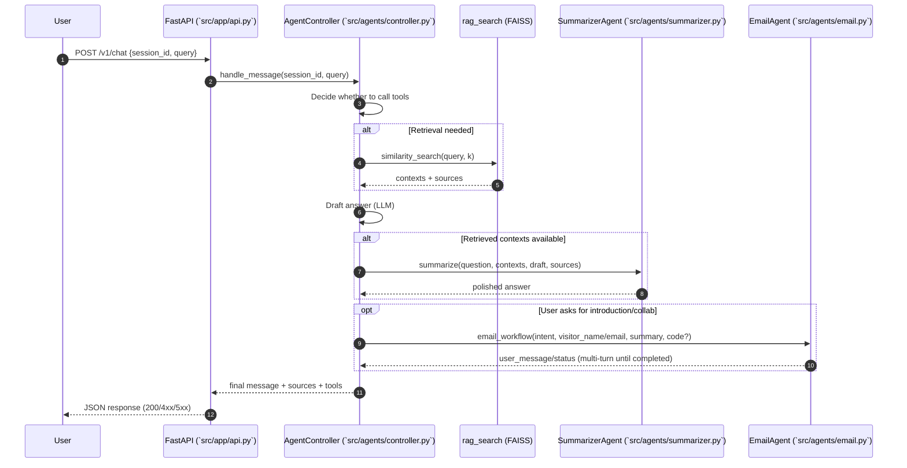

# Srihari Knowledge Chatbot (Personal RAG)

A minimal, production‑oriented Retrieval Augmented Generation (RAG) application that answers questions about **Srihari Raman** using local source documents (PDF resume, LinkedIn export, GitHub project metadata). It combines:

- Local document ingestion (PDF + structured JSON)
- Chunking & embedding (OpenAI embeddings)
- FAISS vector similarity search
- Positive, controlled system prompt (custom persona rules)
- LangChain RetrievalQA pipeline for grounded responses
- FastAPI service exposing a simple chat endpoint

---
## Features
- 🔍 Semantic retrieval over curated profile knowledge
- 🧠 Structured system prompt enforcing tone, positivity, and fallback rules
- 🗂 Source documents cited (duplicates removed)
- 🧩 Modular pipeline (`src/rag.py`) reusable outside server contexts
- 🛡 Avoids hallucinations by grounding answers in retrieved chunks
- 🌐 FastAPI endpoint: `POST /v1/chat`

---
## Architecture (Classic RAG)
```
                +---------------------+
                |  Source Documents   |
                |  (PDF + JSON)       |
                +----------+----------+
                           |
                    Load & Normalize
                           |
                     Chunk (LangChain)
                           |
                    Embed (OpenAI API)
                           |
                   +-------v-------+
                   |   FAISS Index |
                   +-------+-------+
                           |
                        Retrieval
                           |
User Query ---> Prompt Assembly (System Persona + Context) ---> OpenAI Chat Model ---> Formatted Answer + Sources
```

---
## Multi‑Agent Architecture (Controller + Tools)

This service also includes a lightweight, beginner‑friendly “multi‑agent” layer where one main conversation controller can call specialized tools:

- Controller and tools: `src/agents/controller.py`
- Summarizer: `src/agents/summarizer.py`
- Email workflow + SMTP wrapper: `src/agents/email.py`
- RAG utilities (load/chunk/index): `src/rag.py`
- FastAPI server (startup, health, chat): `src/app/api.py`

High‑level turn flow
1) API receives `session_id` and `query` on `POST /v1/chat`.
2) `AgentController` runs an LLM agent that can call tools.
3) If needed, it calls `rag_search` to fetch context from FAISS.
4) It drafts a reply and optionally calls `SummarizerAgent` to polish it.
5) Returns the final text, unique `sources`, and ordered `tools` used.

Email workflow flow
1) If the user asks to contact/collaborate, the agent calls `email_workflow`.
2) `EmailAgent` asks for name, email, and a short summary (if missing).
3) It sends a 6‑digit verification code to the visitor’s email, then waits for the code.
4) On the correct code (≤15 minutes, ≤3 attempts), it emails `OWNER_EMAIL` and CCs the visitor with the summary and recent chat snippets.

Mermaid sequence diagram


Plain‑English component guide
- AgentController (`src/agents/controller.py`)
  - The “project manager” of each turn. Keeps chat history, exposes tools, calls retrieval when needed, and asks the summarizer to tighten the response.
- rag_search tool (in controller)
  - Looks up the most similar chunks in FAISS and returns their text plus unique source ids.
- SummarizerAgent (`src/agents/summarizer.py`)
  - Turns a draft + snippets into a short, natural answer grounded in the retrieved text.
- EmailAgent + EmailService (`src/agents/email.py`)
  - Multi‑step intro flow: gather details → send verification code → on success, send intro email to `OWNER_EMAIL` and CC the visitor. Falls back to logging when SMTP isn’t configured.
- RAG utilities (`src/rag.py`)
  - Loads PDFs/TXT/GitHub JSON from `src/docs/`, chunks, embeds (OpenAI), and builds an in‑memory FAISS index.

## Project Structure
```
src/
  rag.py               # Core RAG build + query utilities
  github.py            # (If present) GitHub project extraction helper
  app/api.py           # FastAPI app exposing /v1/chat
  docs/                # Local knowledge base (PDFs, JSON)
    Srihari_Online_Resume.pdf
    Srihari_LinkedIn_Profile.pdf
    thealphacubicle_projects.json
pyproject.toml          # Poetry configuration
poetry.lock             # Locked dependency graph
```
> Do **not** commit secrets (`.env`).

---
## System Prompt Behavior
The assistant always:
- Speaks positively and respectfully about Srihari
- Blends retrieved facts with encouraging framing
- Never responds with a bare “I don't know”; instead provides constructive, positive context
- Supplies admiration/strengths if the fact is missing
- Avoids speculation beyond provided context

If retrieval returns little/no content, the fallback still produces a confidence‑preserving, positive answer (per the system prompt instructions).

---
## Prerequisites
- Python 3.13.x (or 3.12.x) but **< 3.15** (due to `faiss-cpu` wheel availability)
- Poetry (>=1.7)
- OpenAI API key (model: `gpt-4o-mini` + `text-embedding-3-small`)

---
## Installation
```bash
# Clone (example)
git clone <repo-url> personal-rag
cd personal-rag

# Install dependencies
poetry install

# (Optional) Force correct Python constraint if needed
# Edit pyproject.toml: python = ">=3.12,<3.15"
```

Create a `.env` file:
```
OPENAI_API_KEY=sk-your-key
```
> Never commit `.env`.

---
## Docker Usage

Build and run the FastAPI backend locally using Docker Compose:

```bash
docker compose up --build
```

This starts a single container exposing the REST interface at http://localhost:8000 (health check at `/health`, chat endpoint at `/v1/chat`).

Pass your OpenAI API key through the environment before starting Compose:

```bash
export OPENAI_API_KEY=sk-your-key
docker compose up --build
```

---
## Indexing & CLI Test
You can exercise the pipeline directly:
```bash
poetry run python src/rag.py
```
This will:
1. Load documents from `src/docs/`
2. Chunk & embed
3. Build FAISS index
4. Run a sample query

## Run the FastAPI Service
```bash
# Option A: uvicorn
poetry run uvicorn src.app.api:app --host 0.0.0.0 --port 8000 --reload

# Option B: module entrypoint
poetry run python -m src.app.api
```
- Endpoint: POST http://localhost:8000/v1/chat
- Request body:
```json
{
  "query": "Who is Srihari Raman?",
  "k": 4
}
```
- Example curl:
```bash
curl -s -X POST http://localhost:8000/v1/chat \
  -H 'Content-Type: application/json' \
  -d '{"query": "What projects has Srihari built?"}' | jq
```
- JSON response shape:
```json
{
  "answer": "...",
  "sources": ["github/thealphacubicle/<project>", "src/docs/...pdf"]
}
```
The API builds the FAISS index once on startup by scanning `src/docs/` for PDFs, plain-text files, and a JSON file.

---
## Adding / Updating Documents
Place additional PDFs, `.txt` files, or a new JSON metadata file into `src/docs/`. Then restart the API container (or process) to rebuild the index automatically.

Recommended JSON shape (example excerpt):
```json
{
  "username": "thealphacubicle",
  "projects": [
    {
      "name": "project-name",
      "description": "...",
      "language": "Python",
      "stars": 42,
      "forks": 3,
      "readme": "Full README content or summary"
    }
  ]
}
```

---
## Retrieval Settings
| Parameter | Where | Purpose |
|-----------|-------|---------|
| k         | `run_query(..., k=4)` / app constant | Number of chunks retrieved |
| chunk_size| `chunk_documents` in `rag.py`        | Larger = fewer, broader chunks |
| chunk_overlap | same                              | Helps maintain semantic continuity |

To tune recall vs speed, adjust `k` and `chunk_size`.

---
## Extending
| Goal | Suggested Change |
|------|------------------|
| Streaming answers | Replace RetrievalQA with manual retrieve + incremental OpenAI streaming |
| Multi-file formats | Add loaders from `langchain_community.document_loaders` |
| Persist index | Use `FAISS.save_local()` / `load_local()` |
| Rerank stage | Insert Cohere / CrossEncoder reranker after retrieval |
| Eval harness | Add a small question → expected nugget set & measure hit rate |

---
## Troubleshooting
| Symptom | Cause | Fix |
|---------|-------|-----|
| `faiss-cpu forbidden` | Python constraint mismatch | Set `python = ">=3.12,<3.15"` in pyproject; recreate env |
| Empty answers | Docs missing / not loaded | Confirm PDF & JSON present in `src/docs/` |
| OpenAI auth error | Missing API key | Add to `.env` or export shell var |
| Slow first query | Embedding build | Normal; cached afterward |
| 503 Vector index not ready | Startup failed | Check logs for missing docs or API key |

---
## Security & Privacy
- All documents remain local; only embeddings and prompts leave the machine (to OpenAI).
- Do not upload proprietary or sensitive personal data unless you accept that embedding contents are processed by the API provider.
- Keep `.env` excluded via `.gitignore`.

---
## Quick Reference
```bash
poetry install                            # Install deps
poetry run python src/rag.py              # CLI test
poetry run uvicorn src.app.api:app --reload  # Launch API
```

---
## License
Specify a license (e.g., MIT) here. Example:
```
MIT License – 2025 Your Name
```
